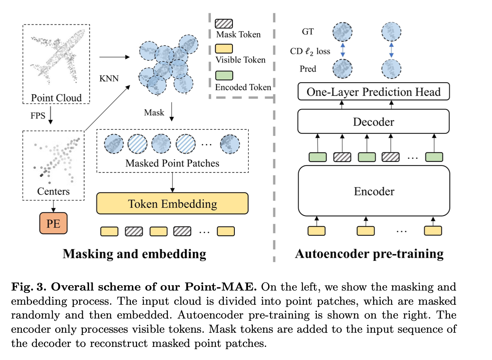
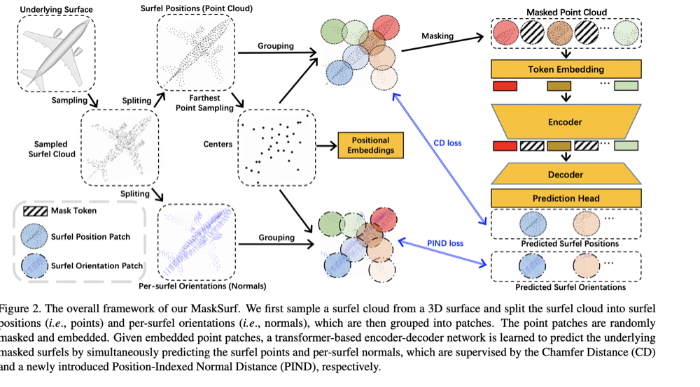

# Normalizingflow_point_MAE
## Target: Literature review and finding ideas

## Core Idea I believe
[Masked Autoencoders Are Scalable Vision Learners](https://arxiv.org/abs/2111.06377)

### Paper discussed with Zeeshan
[Masked Autoencoders for Point Cloud Self-supervised Learning](https://arxiv.org/abs/2203.06604)

The basic idea of this paper is using the self-supervised learning to learns the latent information.

It is usually done by designing a pretext task to pre-train the model, then fine-tune on down- stream tasks. 

How this one works:
1. first processed by a masking and embedding module.

    1.1 get point patch 
    divide input point cloud into irregular point patches (may overlap) via Farthest Point Sampling (FPS) and K-Nearest Neighborhood (KNN) algorithm.
    
    1.2 masking
    considering point patches may overlap, we mask them separately,
    random masking at a high ratio (60%-80%) best
    
    1.3 Embedding
    For the embedding of each masked point patch, we replace it with a share-weighted learnable mask token.
    we implement a lightweight PointNet [29], which mainly consists of MLPs and max pooling layers
    providing centers’ position information to embedding tokens is essential. A simple method for Position Embedding (PE) is mapping coordinates of centers to embedding dimension with a learnable MLP
    
2. a standard Transformer based autoencoder is adopted, including a simple prediction head, to reconstruct the masked parts of the input point cloud.
    2.1 Encoder-decoder
    Our encoder consists of standard Transformer blocks and only encodes visible tokens Tv without mask tokens Tm.
    
    Our decoder is similar to the encoder but contains fewer Transformer blocks. It takes both encoded tokens Te and masks tokens Tm as input.
    
    A full set of positional embeddings is added to every Transformer block, providing location information to all the tokens.
    
    After processing, the decoder only outputs the decoded mask tokens Hm, which are fed to the following prediction head

2. Prediction Head 
    As the last layer of backbone, the prediction head aims to reconstruct masked point patches in coordinate space. We simply use a fully connected (FC) layer as our prediction head.
    
    
[Masked Surfel Prediction for Self-Supervised Point Cloud Learning](https://arxiv.org/abs/2207.03111)

### Papers on Using the Normalizing Flow to Represent Point Cloud

[Representing Point Clouds with Generative Conditional Invertible Flow Networks](https://arxiv.org/abs/2010.11087)

[PointFlow: 3D Point Cloud Generation with Continuous Normalizing Flows](https://openaccess.thecvf.com/content_ICCV_2019/html/Yang_PointFlow_3D_Point_Cloud_Generation_With_Continuous_Normalizing_Flows_ICCV_2019_paper.html)

### Papers may Relative

[PointNet: Deep Learning on Point Sets for 3D Classification and Segmentation](https://arxiv.org/abs/1612.00593)

[Semi-Conditional Normalizing Flows for Semi-Supervised Learning](https://arxiv.org/abs/1905.00505)

The model uses both labelled and unlabeled data to learn an explicit model of joint distribution over objects and labels

[Point-BERT: Pre-training 3D Point Cloud Transformers with Masked Point Modeling](https://arxiv.org/abs/2111.14819)

[Self-Supervised Deep Learning on Point Clouds by Reconstructing Space](https://arxiv.org/abs/1901.08396)

### General Idea:

First idea: on improving the masking.

First of all, using the normalizing flow to convert the samples from gaussian distribution into point cloud distribution.

Making use of the gaussian distribution can probably increase the randomness or effectiveness of the masking because it is more uniform in Gaussian.

Second idea: 
Semi-Conditional Normalizing Flows for Semi-Supervised Learning told us that the use of joint distribution of samples and label.

Thrid idea:
Using the normalizing flow to directly learn the distribution of different class of the point cloud.

Which probably be a idea of implemting in classification problem.
